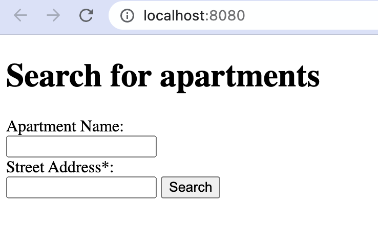
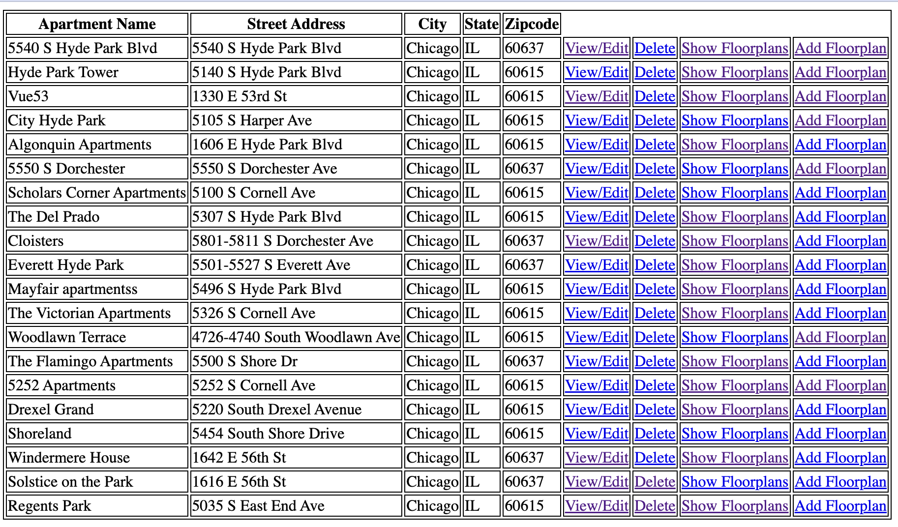
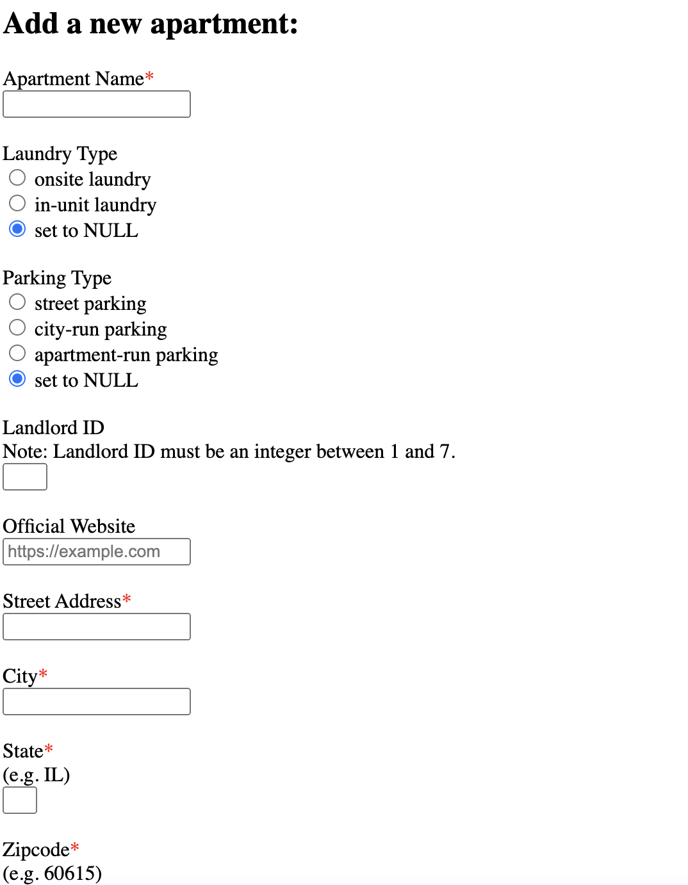

# DB-driven Web App: Apartment Data Management

## How to start
### Step 1: Create and populate database
1. Create database (run in command-line): ```sqlite3 app.db < create_db.sql```
2. Populate database (run in command-line): ```sqlite3 app.db < populate_db.sql```

### Step 2: Launch web server
1. Make sure the bottle library is installed. If not, run ```pip3 install bottle``` to install
2. Run in command-line: ```python3 web.py```
3. Open http://localhost:8080/ in a browser


## Main Features
### Homepage
- In homepage, you can search for apartments by apartment name and street address. Note that the street address is a wildcard search (marked with * symbol). If you leave these two fields blank, all apartments will be shown (limit up to 20 rows).
- You can put "Regents Park" in the apartment name field and "5035" in the street address field to see how the two fields work together for searching.


### Search Results
- This page list the search results (limit up to 20 rows). If no search results, you will see "No apartments found." on this page (You can search for apartments with apartment name equals to "xxx" to check this effect).

- For each apartment, you can view/edit (view detailed information and update attributes), delete, show its floor plans (also limit up to 20 rows; if no related floor plans for this apartment, you will see "No floor plans found for this apartment.". You can create a new apartment to check this effect), and add a new floor plan to this apartment. The new floor plan you provide may already exist in the database, the web app will automatically identify its existence and will link the existed floor plan to this apartment.
- You can add a new apartment in this page by providing the required information.



## Error Handling
- Front-end: You are not able to submit form when leaving the required field blank, or entering unlawful inputs (e.g. when adding a new apartment, the landlord_id range is between 1 and 7, if you enter a landlord_id outside of this range, you will be alerted and prompted to enter again).
- Back-end: The web server will further validate the user input and return a 400 error page showing which field has an error and why (e.g. when you enter a zipcode that is not in 5-digit format, or an invalid state abbreviation). For server-side errors (though not expected to happen for this project), such as sqlite error, the web server will abort 500 with error message.

## Note
- The data in this database is not authentic. Most of them are generated by the faker library of Python.